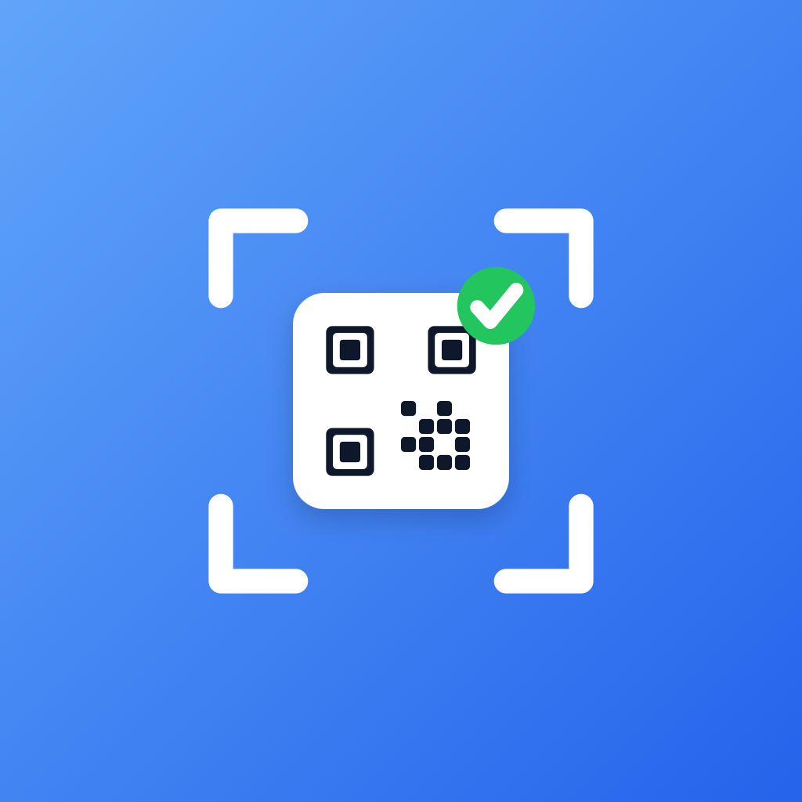
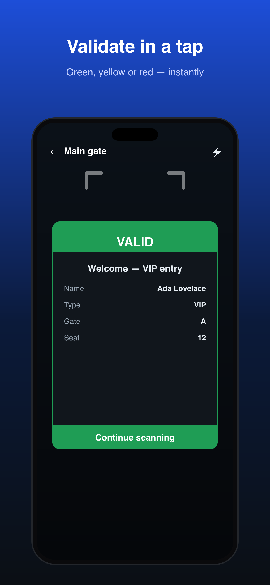
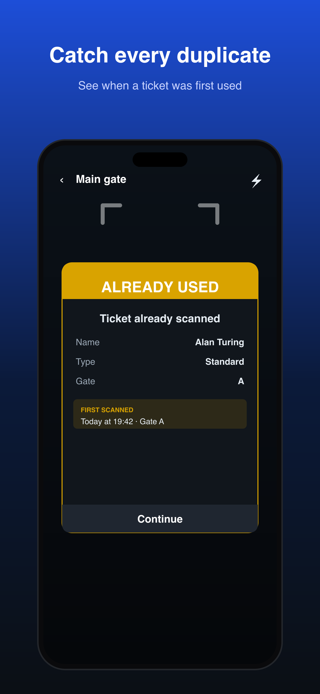
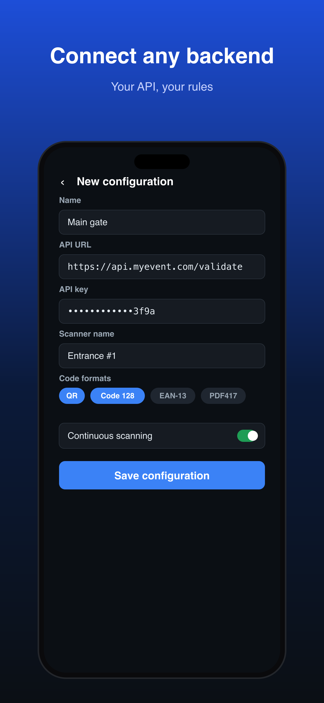
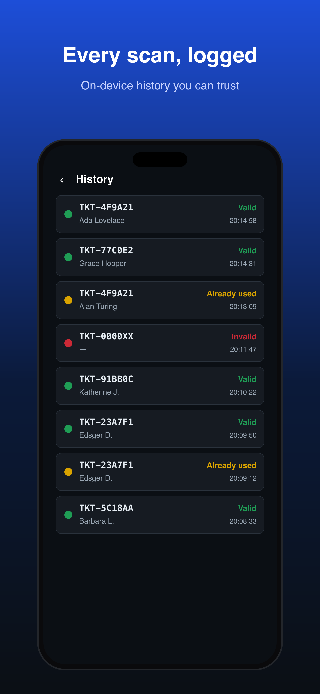

<div align="center">



# Open Ticket Scanner

<strong>Scan &amp; validate event tickets against your own API.</strong><br />
Fast, open source, and built for the door — iOS &amp; Android.

<p>
  <a href="https://apps.apple.com/app/id6784664554"></a>
  <a href="https://play.google.com/store/apps/details?id=nl.fruitcake.openticketscanner"></a>
</p>

<p>
  <a href="https://openticketscanner.com"></a>
  <a href="https://fruitcake.nl"></a>
  <a href="LICENSE"></a>
</p>

<p>
  
  
  
  
</p>

</div>

---

An open-source QR / barcode **ticket scanner** built with Expo + React Native. Two modes:

- **Scan mode** — decode any QR or barcode and show its contents. No backend.
- **Ticket mode** — create named configurations (API URL, optional key, code formats). Each scan is POSTed to your server; the JSON response drives a **green / yellow / red** result popup with ticket details, a server message, and previous-scan info. Tap **Continue** for the next ticket, or enable **continuous mode** to scan hands-free. Scans are kept in a local history and double-scans are debounced.
  - **Manual entry** — type a code when a QR/barcode can't be read.
  - **Per-scan metadata** — a stable device ID, optional scanner/lane name, and the app version are sent with every scan (see [Ticket API contract](#ticket-api-contract)).
  - **Feedback** — optional haptic buzz and/or beep on each result, toggled in **Settings**.

**Available in 7 languages** — English, Dutch, French, German, Spanish, Portuguese and Italian. The app follows the device language automatically, with a manual override in **Settings**.

## Tech

- **Expo SDK 56** (React Native 0.85), TypeScript, [expo-router](https://docs.expo.dev/router/introduction/)
- **[expo-camera](https://docs.expo.dev/versions/latest/sdk/camera/)** `CameraView` for barcode scanning (iOS + Android, MLKit on Android)
- **expo-sqlite** for scan history, **react-native-mmkv** for configs
- **zustand** for reactive config state

> **Why expo-camera, not react-native-vision-camera?** Vision Camera v5 (the version compatible with RN 0.85) only scans codes on iOS — its Android object output throws. expo-camera scans on both platforms using the same native engines (AVFoundation / MLKit). All camera code is isolated in [`src/camera/CameraScanner.tsx`](src/camera/CameraScanner.tsx) if you want to swap it.

## Getting started

This app uses native modules, so it runs in a **development build** (not Expo Go).

```bash
npm install

# Generate native projects
npx expo prebuild

# Run on a real device (recommended — simulators have no camera)
npm run ios       # or: npx expo run:ios --device
npm run android   # or: npx expo run:android
```

For distributable binaries, use [EAS Build](https://docs.expo.dev/build/introduction/) with the profiles in [`eas.json`](eas.json):

```bash
npx eas build --profile preview --platform android   # internal APK
npx eas build --profile production --platform all
```

### Testing the camera without a physical device

- **Android emulator:** open the emulator's **virtual scene** (extended controls) and use the built-in wall image, or point it at a QR shown on your screen.
- **iOS:** the simulator has no camera — use a real device.

## Ticket API contract

In ticket mode the app sends:

```http
POST <your API URL>
Content-Type: application/json
X-App-Version: 1.0.0                # the app version
Authorization: Bearer <apiKey>      # if set (also sent as X-API-Key)

{
  "code": "<scanned value>",
  "type": "qr",                     // or "manual" for typed-in codes
  "configId": "...",
  "scannerName": "Lane 1",          // optional, per-config label (omitted if unset)
  "deviceId": "<stable per-install id>",
  "scannedAt": "<ISO>"
}
```

- **`deviceId`** is a stable identifier generated once per install (persisted in MMKV) — see it under **Settings**.
- **`scannerName`** is an optional label set per configuration to identify the device/lane.
- **`X-App-Version`** header carries the app version from `app.json`.
- **`type: "manual"`** indicates the code was typed in via **Enter code manually** rather than scanned.

The **default** response shape it understands:

```jsonc
{
  "status": "valid" | "used" | "invalid",   // or a boolean `valid`
  "message": "Valid – VIP entry",
  "ticket": { "name": "Ada Lovelace", "type": "VIP", "gate": "A" }
}
```

| status    | popup  |
| --------- | ------ |
| `valid`   | 🟢 green  |
| `used`    | 🟡 yellow |
| `invalid` | 🔴 red    |
| unknown / HTTP 5xx / network error | ⚫ error |

#### Example responses

**Minimal** — just a status (🟢 green). `message` falls back to "Valid ticket"; the popup shows no detail rows.

```json
{ "status": "valid" }
```

**Detailed** — status, message, and ticket fields rendered as key/value rows (🟢 green).

```json
{
  "status": "valid",
  "message": "Valid – VIP entry",
  "ticket": {
    "name": "Ada Lovelace",
    "type": "VIP",
    "gate": "A",
    "seat": "12"
  }
}
```

**Already used** — a previously-scanned ticket (🟡 yellow). The popup also shows the local first-seen time.

```json
{
  "status": "used",
  "message": "Already scanned at 20:14",
  "ticket": { "name": "Grace Hopper", "type": "General", "gate": "A" }
}
```

**Failed / rejected** — an invalid ticket (🔴 red). Return HTTP `200` with this body so the app shows the red popup (a non-2xx is fine too; only HTTP `5xx` / network errors become the ⚫ error state).

```json
{
  "status": "invalid",
  "message": "Ticket not recognised"
}
```

> The boolean form `{ "valid": true }` / `{ "valid": false }` is also accepted as a shorthand for 🟢 green / 🔴 red.

### Adapting to your server's format

Response handling is intentionally isolated to **one file**:
[`src/tickets/parseTicketResponse.ts`](src/tickets/parseTicketResponse.ts). Edit `STATUS_MAP`,
`pickStatus`, `pickMessage`, and `pickTicketFields` to match your JSON — nothing else changes.
Unit tests live in `parseTicketResponse.test.ts`:

```bash
npm test
```

### Try it with the mock server

A tiny zero-dependency mock server is included for local testing:

```bash
node scripts/mock-server.mjs        # listens on http://localhost:8787/validate
```

It returns `valid` / `used` / `invalid` based on the scanned code (see the file header).
Point a config's API URL at `http://<your-computer-ip>:8787/validate` (use your LAN IP, not
`localhost`, so the phone can reach it).

## Provisioning devices (share / QR)

Set up many devices with the same configuration without retyping it.

**To share a config:** open it (Ticket configurations → tap a config, or the 📤 on its row) → **Share / set up another device**. You get a **QR code** + a shareable link, with an **Include API key** toggle (on by default — when on, the QR/link contains your key, so only share it with trusted devices).

**To import on another device:** Ticket configurations → **Scan setup code** and scan the QR, *or* open the shared link. Both land on the same confirmation screen, which adds the config (or offers to update an existing one with the same API URL).

The link encodes the config as query params, e.g.:

```
https://app.openticketscanner.com/configure?v=1&name=Main%20Gate&endpoint=https%3A%2F%2Fexample.com%2Fvalidate&formats=qr,code128&continuous=1&debounce=2000&scanner=Lane%201&key=…
```

The same payload also works via the custom scheme `openticketscanner://configure?…`, which always opens the app if installed (no hosting needed). All build/parse logic is in one tested module: [`src/tickets/configLink.ts`](src/tickets/configLink.ts).

### Generating a provisioning link yourself

You don't need the app to build a link — a backend can generate per-device links/QRs. The payload is plain URL query params (all values URL-encoded):

| Param        | Required | Description                                                                 |
| ------------ | -------- | --------------------------------------------------------------------------- |
| `v`          | yes      | Payload version — currently `1`.                                            |
| `endpoint`   | yes      | Validation API URL (`http`/`https`). The only strictly required field.      |
| `name`       | no       | Config name. Defaults to the endpoint's host.                               |
| `formats`    | no       | Comma-separated code formats. Unknown values are dropped; defaults to `qr`. |
| `continuous` | no       | `1` or `0` — continuous (hands-free) scanning. Default `0`.                  |
| `debounce`   | no       | Debounce window in ms. Default `3000`.                                       |
| `scanner`    | no       | Scanner/lane label sent with every scan.                                    |
| `key`        | no       | API key (**secret** — include only for trusted shares).                     |

Valid `formats` values: `qr`, `ean13`, `ean8`, `code128`, `code39`, `code93`, `codabar`, `itf14`, `upc_a`, `upc_e`, `pdf417`, `aztec`, `datamatrix`.

```js
// Reproduce the exact link the app generates (Node or browser):
const params = new URLSearchParams({
  v: '1',
  name: 'Main Gate',
  endpoint: 'https://example.com/validate',
  formats: 'qr,code128',
  continuous: '1',
  debounce: '2000',
  scanner: 'Lane 1',
});
// params.set('key', 'your-api-key'); // only for trusted shares
const httpsLink = `https://app.openticketscanner.com/configure?${params}`;
const schemeLink = `openticketscanner://configure?${params}`;
```

Render either string as a QR code (e.g. with `qrcode`) to provision devices from your own tooling.

### Hosting universal links (optional)

The QR/share links use `https://app.openticketscanner.com`. For a tapped HTTPS link to open the app directly (instead of the browser), host two files on that domain and rebuild the app:

1. **`/.well-known/apple-app-site-association`** (iOS) — template in [`web/.well-known/apple-app-site-association`](web/.well-known/apple-app-site-association). Replace `REPLACE_WITH_APPLE_TEAM_ID` with your Apple Developer **Team ID**. Serve as `application/json`, over HTTPS, **with no redirects**.
2. **`/.well-known/assetlinks.json`** (Android) — template in [`web/.well-known/assetlinks.json`](web/.well-known/assetlinks.json). Replace the fingerprint with your app-signing cert's **SHA-256** (`keytool -list -v -keystore …`, or copy it from the Play Console / `eas credentials`).

An optional app-not-installed fallback page is in [`web/configure/index.html`](web/configure/index.html) (add your store URLs).

The matching native config (`ios.associatedDomains`, Android `intentFilters`) is already in [`app.json`](app.json) — changing it requires a rebuild (`npx expo prebuild` + `expo run:*`). **Without this hosting the custom scheme and the in-app QR scanner still work**; only tapping the raw HTTPS link needs it.

## Project structure

```
app/                       expo-router screens
  index.tsx                home (mode picker + config list)
  scan.tsx                 generic scan mode
  history.tsx              scan history
  settings.tsx             language + haptics/sound toggles + device info
  configure.tsx            import-config confirmation (deeplink + QR target)
  configure-scan.tsx       scan a provisioning QR code
  share/[configId].tsx     share a config via QR + link
  tickets/
    configs/index.tsx      manage configurations
    configs/[id].tsx       create / edit configuration
    [configId]/scan.tsx    ticket scanning + result popups + manual entry
src/
  camera/                  CameraScanner wrapper + scan debounce
  feedback/                haptics + beep feedback
  tickets/                 api client, response adapter, configLink, types
  storage/                 mmkv (configs) + sqlite (history)
  state/                   zustand config + settings stores
  ui/                      result popup, toast, history row, theme
  i18n/                    i18n-js setup + 7 locale catalogs (en, nl, fr, de, es, pt, it)
  utils/                   device id, app version, id, formatting
web/                       universal-link hosting templates (AASA, assetlinks, fallback)
```

## License

MIT — see [LICENSE](LICENSE).

---

<div align="center">
  <a href="https://fruitcake.nl"></a><br />
  <sub>Built with care by <a href="https://fruitcake.nl"><strong>Fruitcake</strong></a> · <a href="https://openticketscanner.com">openticketscanner.com</a><br />
  Need a ticketing backend or a custom build? <a href="https://fruitcake.nl">Get in touch.</a></sub>
</div>
